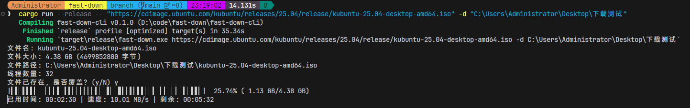

# fast-down 快下


[](https://github.com/share121/fast-down/actions)
[](https://crates.io/crates/fast-down)
[](https://docs.rs/fast-down)


`fast-down` **全网最快**多线程下载库



## 优势

1. 下载全网最快
2. 支持断点续传
3. 代码安全健壮
4. 自研调度算法：超强 [fast-steal](https://github.com/share121/fast-steal) 任务窃取算法
5. 跨平台软件 (Windows, Linux, MacOS)
6. 错误自动恢复，下载过程中随意断网都可以保证文件正确下载
7. 详细进度跟踪

```bash
超级快的下载器命令行界面

Usage: fast-down.exe [OPTIONS] <URL>

Arguments:
  <URL>  要下载的URL

Options:
  -f, --allow-overwrite
          强制覆盖已有文件
      --no-allow-overwrite
          不强制覆盖已有文件
  -c, --continue
          断点续传
      --no-continue
          不断点续传
  -d, --dir <SAVE_FOLDER>
          保存目录
  -t, --threads <THREADS>
          下载线程数
  -o, --out <FILE_NAME>
          自定义文件名
  -p, --all-proxy <PROXY>
          代理地址 (格式: http://proxy:port 或 socks5://proxy:port)
  -H, --header <Key: Value>
          自定义请求头 (可多次使用)
      --download-buffer-size <DOWNLOAD_BUFFER_SIZE>
          下载缓冲区大小 (单位: B)
      --write-buffer-size <WRITE_BUFFER_SIZE>
          写入缓冲区大小 (单位: B)
      --progress-width <PROGRESS_WIDTH>
          进度条显示宽度
      --retry-gap <RETRY_GAP>
          重试间隔 (单位: ms)
      --browser
          模拟浏览器行为
      --no-browser
          不模拟浏览器行为
  -y, --yes
          全部确认
      --no-yes
          不全部确认
      --no
          全部拒绝
      --no-no
          不全部拒绝
  -v, --verbose
          详细输出
      --no-verbose
          不详细输出
  -h, --help
          Print help
  -V, --version
          Print version
```


